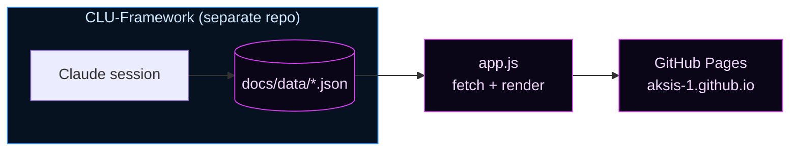

<div align="center">

# C.L.U. — Live Intelligence Site

**The public, real-time mirror of the [C.L.U. autonomous trading system](https://github.com/AKSIS-1/CLU-Framework) (v1.0 "Compounder").**


### [→ View the live site](https://aksis-1.github.io/)

</div>

---

## What This Is

A static, dependency-free dashboard that renders C.L.U.'s trading intelligence directly from JSON the agent writes after every session. **There is no backend and no build step** — just `index.html`, `app.js`, and the CSS reading data files. What you see here *is* what CLU sees internally.

The site is intentionally **read-only and passive**. It polls `latest.json` every 5 minutes (and on demand via the refresh chip). When CLU commits a new report to the data files, the next poll reflects it — no deploy, no pipeline.



---

## Four Tabs

| Tab | Source | Shows |
| :-- | :----- | :---- |
| ◈ **Live Report** | `data/latest.json` | Portfolio allocation + performance, active positions, active-intelligence log, learned patterns, watchlist movers, earnings, stop-loss alerts, trades, top opportunities |
| ↗ **Projected Journey** | `data/projected_journey.json` | **Time-weighted return** chart (deposit-excluded), milestone ladder, added-funds simulator, next decisions, weekly recap |
| ⚙ **Ticker Engine** | TwelveData (live) | A deterministic, no-AI quant read for any ticker — see below |
| ◷ **Past Reports** | `data/archive/index.json` | One final report per calendar day, selectable from the sidebar |

---

## ⚙ Ticker Engine

A client-side quant analyzer (no AI, no recommendations) that pulls recent price history for any stock/ETF/index and returns a structured read:

- **Tier** — classifies the ticker as **CORE** (broad/sector ETF), **DRIP** (dividend/income ETF), or **LAB** (single stock) — the same three-sleeve model the framework trades.
- **Avg Yearly Return** — annualized return (CAGR) over the fetched window.
- **DRIP dividend growth** — for DRIP-tier tickers, the average year-over-year dividend growth from the dividend history.
- **Horizon outlook** — short / intermediate / long-term scores with the evidence behind each.
- **Setup, conviction & risk** — a rules-based setup label (e.g. *Confirmed Uptrend*, *Falling Knife*), a 0–100 conviction gauge, and a volatility-based risk band.
- **Metrics** — 1/3/6-month returns, RSI, volatility, ATR%, distance vs 50/200-day.

> **BETA · not financial advice.** Deterministic technical model from price/volume only. Stocks, ETFs & indexes — no crypto.

---

## ↗ Projected Journey

- **Growth chart** renders a **time-weighted return index** (`growth_chart.return_index`) that *excludes deposits* — so the curve reflects performance, not the size of your contributions. (It falls back to an honestly-labeled "includes deposits" account-value line if a TWR series isn't present.)
- **Added-funds simulator** projects the effect of recurring contributions under an assumed **1.5%/month** growth rate (illustrative — markets vary).
- **Milestone ladder**, **next likely decisions**, and the **weekly recap** round out the tab.

---

## Project Structure

```
docs/                     # GitHub Pages root
├── index.html            # Layout, tabs, section containers
├── app.js                # Fetch + render (Live Report, Journey, Ticker Engine, Archive)
├── hud.css               # v5 "HUD" layout + components
├── theme-v5.css          # "Ice Transmission" theme tokens
└── data/
    ├── latest.json           # Current live report          ← written by CLU
    ├── projected_journey.json# Weekly trajectory            ← written by CLU
    └── archive/
        ├── index.json        # Manifest (one entry per day) ← written by CLU
        └── YYYY-MM-DD-ah.json# Archived final daily reports ← written by CLU
```

All data files (except the live Ticker Engine feed) are written exclusively by CLU sessions in the framework repo. This site is read-only.

> **Security note:** the TwelveData key in `app.js` is a browser-delivered key and is public by nature. It must be a throwaway, domain-restricted, rate-capped key — rotate it if exposed; never reuse it server-side.

---

## Run It Locally

No build, no dependencies — just serve `docs/` over HTTP (required for `fetch` to load local JSON):

```bash
cd docs
python3 -m http.server 8099
# open http://localhost:8099
```

To preview with different data, edit `docs/data/latest.json` or `docs/data/projected_journey.json` and refresh. All rendering is client-side.

---

## Design

The **"Ice Transmission"** theme: deep `#00010d` background, icy-blue → magenta accents, Orbitron display font + JetBrains Mono body, animated power-on motion, and a rotating disc mark in the header. Fully responsive — the 2-column desktop layout collapses to single-column on mobile. No CSS frameworks, no JS dependencies.

<div align="center">

---

Rendered from live agent output · No crypto · Guardrails always active

</div>
