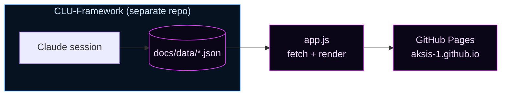
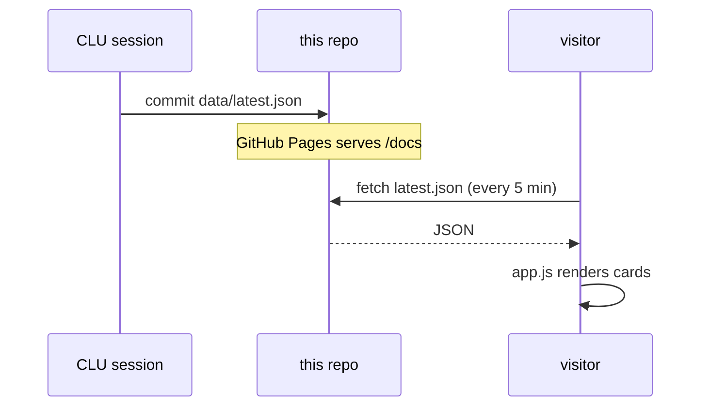

<div align="center">

# C.L.U. — Live Intelligence Site

**The public, real-time mirror of the [C.L.U. autonomous trading system](https://github.com/AKSIS-1/CLU-Framework).**


### [→ View the live site](https://aksis-1.github.io/)

</div>

---

## What This Is

A static, dependency-free dashboard that renders C.L.U.'s trading intelligence directly from JSON the agent writes after every session. **There is no backend and no build step** — just `index.html`, `app.js`, and `style.css` reading data files. What you see here *is* what CLU sees internally.

The site is intentionally **read-only and passive**. It polls `latest.json` every 5 minutes (and on demand via the refresh chip). When CLU commits a new report to this repo, the next poll reflects it — no deploy, no pipeline.



---

## Three Tabs

| Tab | Source | Shows |
| :-- | :----- | :---- |
| ◈ **Live Report** | `data/latest.json` | Portfolio overview, active positions with composite scores, Quant Signal Matrix, watchlist movers, learned patterns, top opportunities |
| ↗ **Projected Journey** | `data/projected_journey.json` + `data/latest.json` | Growth chart, intelligence-evolution phases, **Accuracy & Self-Correction**, strategy DNA, risk profile, milestones (weekly) |
| ◷ **Past Reports** | `data/archive/index.json` | One final report per calendar day, selectable from the sidebar |

---

## ◈ Signal Panels (v0.6+)

### Quant Signal Matrix — Live Report tab

Rendered from `signal_matrix` in `latest.json`, which CLU mirrors directly from the Python engine output each session. Displays one row per tracked ticker:

| Column | What it shows |
| :----- | :------------ |
| RSI | 14-day relative strength with Overbought / Oversold label |
| MACD | Bullish or Bearish crossover state |
| Z-Score | 20-day rolling Z-score with OVERBOUGHT / OVERSOLD / Normal label |
| Vol | Volume ratio vs 20-day average — confirms price move conviction |
| Trend50 | Price relative to the 50-day SMA — Up or Down |
| Composite S | Weighted score `S ∈ [−1,+1]` rendered as a horizontal color gauge. Negative (red) = bearish, centered = neutral, positive (green) = bullish. |
| Signal | BULLISH / NEUTRAL / BEARISH badge based on composite score thresholds |

This panel is a direct readout of the framework's Python signal engine — the same data CLU uses to make entry decisions.

### Accuracy & Self-Correction — Projected Journey tab

Shows the state of CLU's closed learning loop. Moved to the Projected Journey tab because it tracks CLU's intelligence trajectory over time, not just the current session:

- **Win rate** — percentage of evaluated trades where the 5-day outcome was profitable
- **Trades graded** — number of BUY entries with confirmed outcomes
- **Awaiting 5-day** — entries still in their evaluation window
- **Intelligence phase** — current phase in CLU's five-phase maturity model (Foundation through Autonomous Optimization)
- **DO-NOT-TRADE conditions** — signal patterns auto-blocked by the self-correction loop after cumulative losses cross the −1.5 threshold
- **Recent ledger** — last few BUY entries with entry conditions and accuracy delta

---

## How Data Flows



The JSON schemas are defined and owned by the framework repo — see [CLU.md §11–§12](https://github.com/AKSIS-1/CLU-Framework/blob/main/CLU.md). This repo renders them; it does not define them. No account numbers or personal identifiers ever appear in any published JSON file.

---

## Project Structure

```
docs/                     # GitHub Pages root
├── index.html            # Layout, tabs, section containers
├── app.js                # Fetch + render (Live Report, Journey, Archive)
├── style.css             # "Ice Transmission" theme — neon, Orbitron/JetBrains Mono
└── data/
    ├── latest.json           # Current live report          ← written by CLU
    ├── projected_journey.json# Weekly trajectory            ← written by CLU
    └── archive/
        ├── index.json        # Manifest (one entry per day) ← written by CLU
        └── YYYY-MM-DD-ah.json# Archived final daily reports ← written by CLU
```

All data files are written exclusively by CLU sessions in the framework repo. This site is read-only.

---

## Run It Locally

No build, no dependencies — just serve the `docs/` folder over HTTP (required for `fetch` to load local JSON files):

```bash
cd docs
python3 -m http.server 8099
# open http://localhost:8099
```

To preview with different data, edit `docs/data/latest.json` or `docs/data/projected_journey.json` and refresh. All rendering is client-side.

---

## Design

The **"Ice Transmission"** theme: deep `#00010d` background, icy-blue → magenta accents, Orbitron display font + JetBrains Mono body, animated ticker banners, and a rotating disc mark in the header. Fully responsive — 2-column desktop layout collapses to single-column on mobile.

All visual tokens (colors, spacing, font stacks, component styles) live in `style.css`. No external CSS frameworks. No JavaScript dependencies. The entire front-end is three files.

The composite score gauge — a horizontal `−1…+1` bar that fills green or red from center — is the primary visual language for signal strength. It appears on the signal matrix, active positions, watchlist movers, and opportunity cards.

---

## ◌ Future of the Site

The site is built to grow alongside CLU's capabilities. As the framework matures through its intelligence phases, the dashboard will reflect that evolution.

**Near-term**
- Win rate over time chart — a line graph in the Projected Journey tab showing how CLU's accuracy has trended across sessions, making the learning curve visible
- Signal history per ticker — expand the signal matrix rows to show how RSI / Z-score / composite have moved across the last N sessions, surfacing trend and momentum in the signals themselves
- Milestone progress bar — visual indicator on the Journey tab showing progress from current portfolio value toward each milestone target

**Medium-term**
- Position history view — entry and exit visualization per ticker on a timeline, overlaid with the signal matrix state at entry; makes the thesis/outcome connection explicit
- Sector correlation heatmap — a color-coded grid showing correlation between current positions, surfacing hidden concentration risk at a glance
- Accuracy breakdown by signal condition — which of the five compound gate criteria (Z-score, RSI, MACD, trend, composite) correlates most strongly with CLU's wins vs losses; rendered as small bar charts in the Accuracy panel

**Long-term**
- Interactive deep-dive — click any ticker in the signal matrix to expand a panel with its full signal history, recent news context, and historical accuracy for that specific name
- Projected vs actual comparison — once CLU has several months of history, add a view overlaying projected growth curves from past weeks against what actually happened; makes the confidence calibration process visible
- Mobile push notifications — opt-in alerts when CLU executes a trade or when a stop-loss threshold is approached (requires a thin service worker layer)

<div align="center">

---

Rendered from live agent output · No crypto · Guardrails always active

</div>
