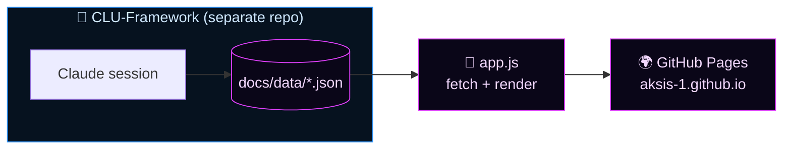
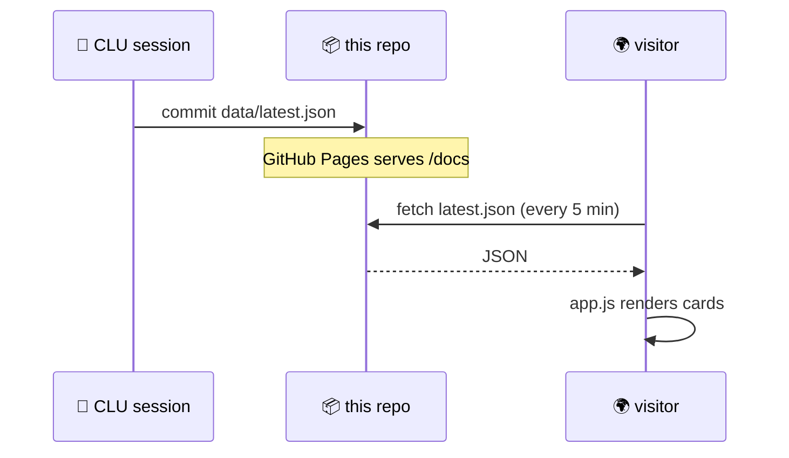

<div align="center">

# C.L.U. — Live Intelligence Site

**The public, real-time mirror of the [C.L.U. autonomous trading system](https://github.com/AKSIS-1/CLU-Framework).**


### [→ View the live site](https://aksis-1.github.io/)

</div>

---

## What This Is

A static, dependency-free dashboard that renders C.L.U.'s trading intelligence directly from JSON the agent writes at the end of every 6:00 AM and 3:30 PM session. **There is no backend and no build step** — just `index.html`, `app.js`, and `style.css` reading data files. What you see here *is* what CLU sees internally.



---

## Three Tabs

| Tab | Source | Shows |
| :-- | :----- | :---- |
| ◈ **Live Report** | `data/latest.json` | Portfolio, positions, **Quant Signal Matrix**, watchlist movers, **Accuracy & Self-Correction**, learned patterns, top opportunities |
| ↗ **Projected Journey** | `data/projected_journey.json` | Growth chart, intelligence-evolution phases, strategy DNA, risk profile, milestones (weekly) |
| ◷ **Past Reports** | `data/archive/index.json` | One final report per calendar day |

### Signature panels (v0.6+)

- **🧮 Quant Signal Matrix** — RSI, MACD, Z-score, volume & trend per ticker, each collapsed into a composite score `S ∈ [−1,+1]` shown as a color gauge. A direct readout of the framework's Python signal engine.
- **◎ Accuracy & Self-Correction** — win rate, trades graded vs. awaiting their 5-day outcome, current intelligence phase, and the auto-learned `DO-NOT-TRADE` conditions. The learning loop, made public.

---

## How Data Flows

The site is intentionally **read-only and passive**. It polls the JSON every 5 minutes (and on demand via the refresh chip). When CLU commits a new `latest.json` to this repo, the next poll reflects it — no deploy needed beyond GitHub Pages serving the file.



---

## Project Structure

```
docs/                     # GitHub Pages root
├── index.html            # Layout, tabs, section containers
├── app.js                # Fetch + render (Live Report, Journey, Archive)
├── style.css             # "Ice Transmission" theme — neon, Orbitron/JetBrains Mono
└── data/
    ├── latest.json           # Current live report  ← written by CLU
    ├── projected_journey.json# Weekly trajectory    ← written by CLU
    └── archive/
        ├── index.json        # Manifest (one entry per day)
        └── YYYY-MM-DD-ah.json# Archived final daily reports
```

> The JSON schemas are defined and owned by the framework repo — see [CLU.md §11–§12](https://github.com/AKSIS-1/CLU-Framework/blob/main/CLU.md). This repo renders them; it does not define them.

---

## Run It Locally

No build, no dependencies — just serve the `docs/` folder over HTTP (needed so `fetch` can load the JSON):

```bash
cd docs
python3 -m http.server 8099
# open http://localhost:8099
```

To preview with different data, edit `docs/data/latest.json` and refresh.

---

## Design

The **"Ice Transmission"** theme: deep `#00010d` background, icy-blue → magenta accents, Orbitron display + JetBrains Mono body, animated ticker banners and a rotating disc mark. Fully responsive (2-column desktop → single-column mobile). All visual tokens live in `style.css`.

<div align="center">

---

Rendered from live agent output · No crypto · Guardrails always active

</div>
